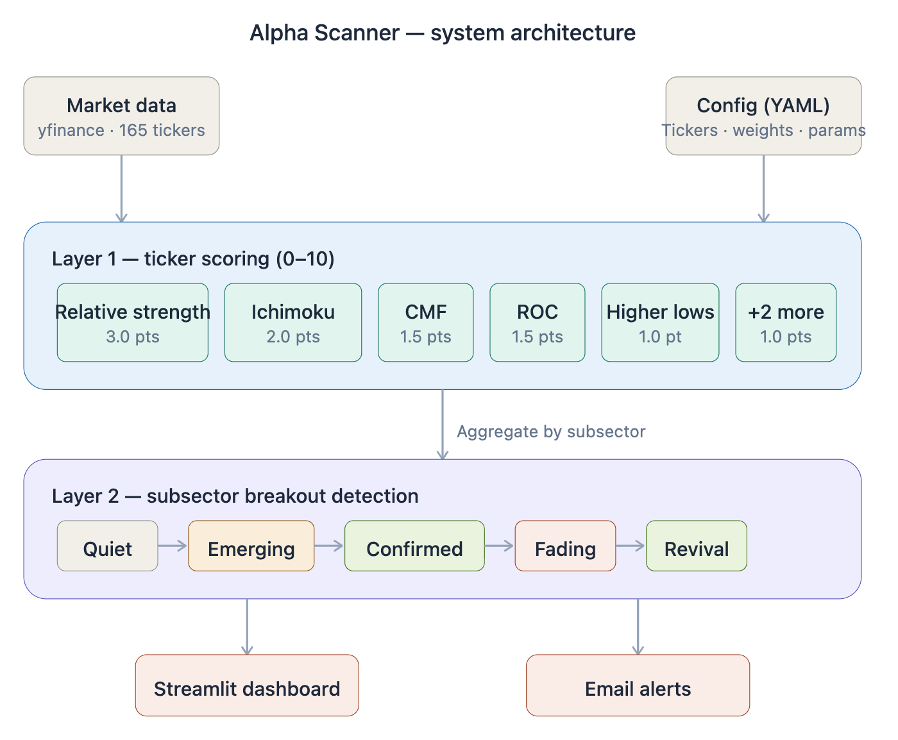
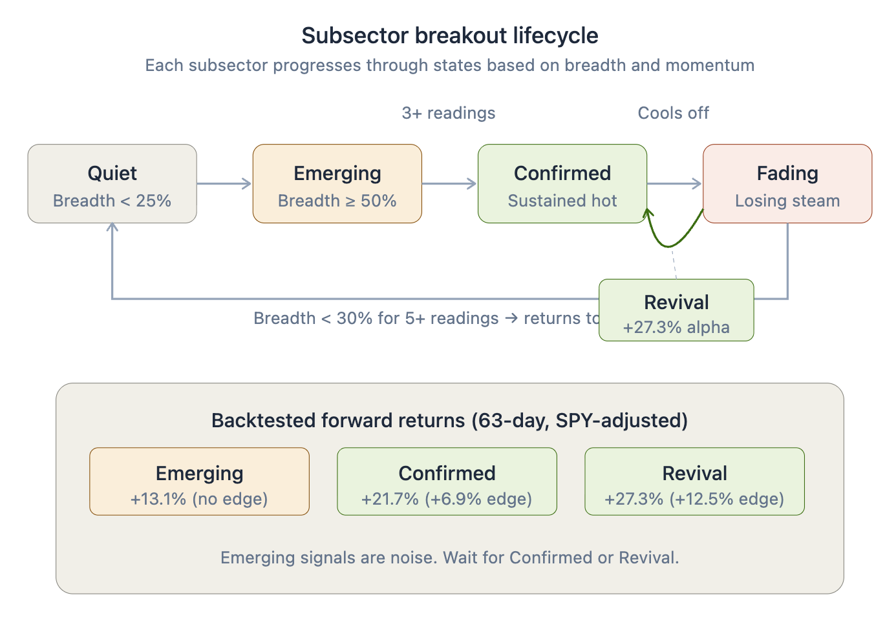
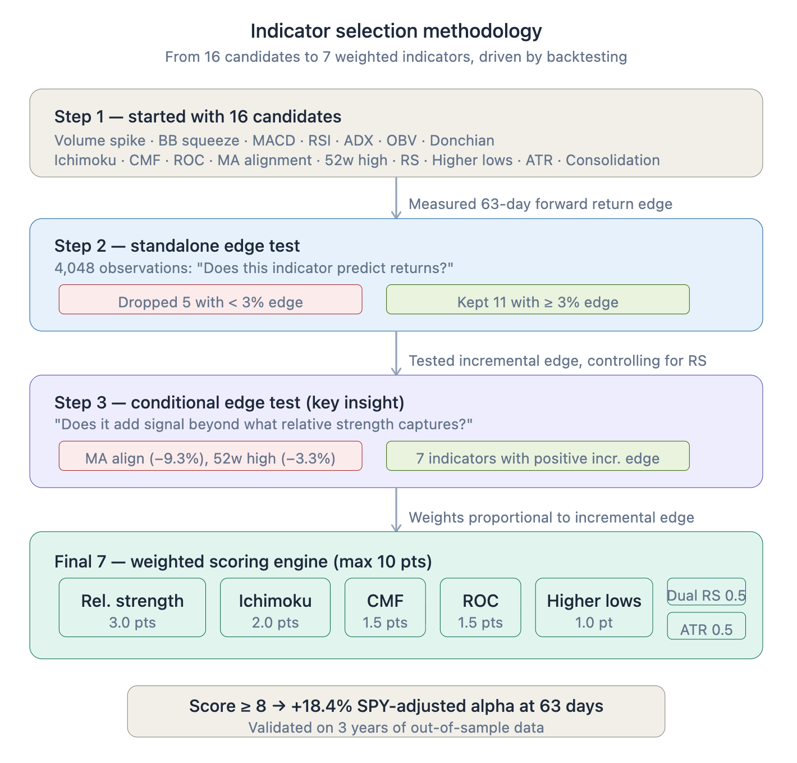

# Alpha Scanner

**A momentum breakout detection and automated trading system that identifies when entire market subsectors — not just individual stocks — are experiencing coordinated technical breakouts, and executes paper trades against the resulting signals.**

    

<!--
📸 SCREENSHOT: Add a hero screenshot of the dashboard here
Recommended: Full-width screenshot of the Tickers page showing the breakouts table
Save as: docs/images/dashboard-hero.png
-->
[Alpha Scanner Dashboard](https://alphascanner.streamlit.app/)

---

## The Idea

I built Alpha Scanner to answer a question I kept running into as an investor: **how do you systematically catch a sector rotation before it's obvious?**

In early 2025, I watched AI infrastructure stocks break out in sequence — first GPUs, then networking, then memory, then power. Each wave was visible in hindsight, but hard to catch in real time. The stocks that moved first showed the same technical signatures: rising relative strength, expanding volatility, accumulating institutional volume. And crucially, they moved *together* — when one stock in a subsector broke out, the rest often followed.

Alpha Scanner automates that pattern recognition. It scores 180 stocks across 9 sectors and 31 subsectors on a 0–10 scale, detects when an entire subsector is breaking out simultaneously, and **automatically executes paper trades via the Alpaca API** — with real GTC stop orders for downside protection. The result is a self-running signal pipeline that tells you both **where to look** (which subsectors are heating up), **what to do** (which individual stocks are scoring highest), and — if you want to close the loop — **executes the resulting trades**.

---

## How It Works

Alpha Scanner operates in three layers:

<!--
📸 SCREENSHOT: Architecture diagram
Save as: docs/images/architecture.png
-->


### Layer 1 — Ticker Scoring

Each stock is scored daily using 7 technical indicators, weighted by their empirically-tested predictive power:

| Indicator | Weight | What It Detects |
|-----------|--------|-----------------|
| **Relative Strength vs. S&P 500** | 3.0 pts | Stocks outperforming the market — the single strongest predictor of future returns |
| **Ichimoku Cloud** | 2.0 pts | Confirmed uptrend with price above a bullish cloud formation |
| **Chaikin Money Flow** | 1.5 pts | Institutional buying pressure — "smart money" accumulating shares |
| **Rate of Change** | 1.5 pts | Strong recent price momentum over 21 days |
| **Higher Lows** | 1.0 pt | Staircase uptrend pattern — each pullback is shallower than the last |
| **Dual-Timeframe RS** | 0.5 pts | Momentum *acceleration* — strong AND getting stronger |
| **ATR Expansion** | 0.5 pts | Expanding volatility, often signaling the start of a big move |

**Max score: 10.** Tickers are then classified into 5 tiers:

| Tier | Score Range | Meaning |
|---|---|---|
| 🔴 **Fire** | 9.5+ | Exceptional — nearly every signal firing at once |
| 🟠 **Hot** | 8.5–9.5 | Actionable breakout with high conviction |
| 🟡 **Warm** | 7–8.5 | Setup is building but not yet high-conviction |
| 🔵 **Tepid** | 5–7 | Some signals present — watchlist territory |
| 🟦 **Cold** | <5 | Few or no technical signals |

### Layer 2 — Subsector Breakout Detection

Individual ticker scores are aggregated into subsector-level metrics. A state machine monitors each of the 31 subsectors and tracks their progression through a breakout lifecycle:

<!--
📸 SCREENSHOT: State machine diagram
Save as: docs/images/state-machine.png
-->


When 50%+ of the stocks in a subsector are scoring 6 or higher ("hot"), that subsector enters the breakout pipeline. If it sustains that breadth for 3 consecutive readings, it's **Confirmed** — the highest-conviction signal.

### Layer 3 — Automated Trade Execution

Signals don't just sit on a dashboard. A nightly pipeline (`trade_executor.py`, run by GitHub Actions after US market close) places real paper-trading orders via Alpaca:

- **Entry**: score ≥ 8.5 for 3 consecutive trading days → submit a 3% limit order (DAY TIF) for the next session's open
- **Exit**: score drops below 5.0, OR the 20% trailing stop fires (real GTC stop orders held at Alpaca)
- **Sizing**: 8.3% of equity per position, capped at 95% total commitment (5% cash floor)
- **Max concurrent**: 12 positions

This configuration was chosen by head-to-head backtesting of 4 entry-mode variants (baseline / defensive / 2% limit / 3% limit). Limit-3% produced the best risk-adjusted result: **+433% return, 3.16 Sharpe, 4.88 Sortino** over the validation window, vs +417% / 2.86 Sharpe for the market-order baseline — and critically, zero negative-cash days vs 70 for baseline.

---

## What I Tested — and What I Learned

The indicator weights above weren't chosen by intuition. They're the result of a systematic backtesting process that started with 16 candidate indicators, tested each one against 3 years of historical data, and progressively narrowed to the 7 that actually predict future returns.

### Starting with 16 indicators, keeping 7

I began with every commonly-used technical indicator I could find: moving average crossovers, RSI, MACD, Bollinger Bands, volume spikes, On-Balance Volume, ADX, Donchian channels, and more. Each was tested for a simple metric: **when this indicator fires, do stocks perform better over the next 63 trading days than when it doesn't?**

The results surprised me:

<!--
📸 SCREENSHOT: Indicator ranking chart or table
Save as: docs/images/indicator-ranking.png
-->


**Top performers** — Relative Strength (+13.3% edge), Ichimoku Cloud (+10.9%), Higher Lows (+7.7%). These earned the highest weights.

**Near-useless** — Volume Spike (+0.7% edge), Bollinger Band Squeeze (+0.4%), MACD Crossover (+0.9%). These were dropped entirely.

**The biggest surprise** — Moving Average Alignment had a +7.5% standalone edge, but when I tested it *controlling for Relative Strength*, it actually had a **negative** incremental edge of −9.3%. It was completely redundant with RS and added noise. This is why conditional testing matters: an indicator that looks good in isolation can be harmful in combination.

### Validating that scores predict returns

The scoring system was validated against SPY-adjusted forward returns. Higher scores consistently produce higher alpha:

| Score Threshold | 21-Day Alpha | 63-Day Alpha |
|----------------|--------------|--------------|
| ≥ 6 | +3.2% | +8.5% |
| ≥ 7 | +5.1% | +12.3% |
| ≥ 8 | +7.4% | +18.4% |
| ≥ 9 | +9.1% | +22.7% |

The monotonic increase across thresholds confirms the scoring system is capturing real signal, not noise.

### Subsector-level signal diagnostics

Bootstrap confidence intervals on Spearman ρ(sm10 score, 63-day forward return) across all 31 subsectors show **26 of 31 subsectors have statistically significant signal** at 95% CI — 15 positive, 11 negative, 5 inconclusive.

Strongest positive: **Chips — Networking/Photonics** (ρ = +0.264, tight CI, N = 1,824 — highest-confidence finding). Strongest negative: **Industrial Robotics & Automation** (ρ = −0.507). The signal is broadly distributed across AI/Tech subsectors, partly concentrated in semiconductors, and modestly present in Satellite Communications, Nuclear Reactors, and a few others. Full diagnostic in `signal_diagnostics_subsector.py` and `signal_diagnostics_significance.py`.

### Testing whether subsector detection adds value

The subsector layer was validated separately. The key finding: **not all states are equal.**

| Subsector State | Avg Alpha (63-day) | Edge vs. Baseline |
|-----------------|-------------------|-------------------|
| Emerging | +13.1% | −1.7% (no better than random) |
| Confirmed | +21.7% | +6.9% |
| **Revival** | **+27.3%** | **+12.5%** |

Emerging signals — when a subsector first starts to heat up — are actually noise. They don't beat baseline. But **Confirmed** breakouts (sustained for 3+ readings) and **Revival** signals (a subsector that faded and then recovered) show strong, actionable alpha.

### Testing portfolio execution logic

Beyond the scoring edge, there's a separate question: how do you *turn* a stream of signals into a portfolio? I ran two backtest suites:

- **`sizing_comparison_backtest.py`** — compared 4 portfolio-construction strategies (Fixed/5-Max, Fixed/10-Max, Dynamic/Trim, Fixed/10+Swap) plus sweeps over position cap, stop-loss strategy, and entry threshold.
- **`entry_mode_backtest.py`** — compared 4 entry-execution modes (market with no cash floor / market with 5% floor / 2% limit / 3% limit), to answer a specific live-trading bug where an overnight gap of 15% on AEHR caused a −$2,625 cash overrun.

Results from these drove the current live configuration: **12-position cap, 8.3% dynamic sizing, 20% fixed stop, 3% limit orders, 5% cash floor, Alpaca-first pricing.**

---

## Universe Coverage

The system tracks 180 tickers across 9 sectors and 31 subsectors:

| Sector | Tickers | Subsectors | Key Themes |
|--------|---------|------------|------------|
| AI & Tech Capex | 101 | 15 | GPUs, memory, networking, power, data centers, AI-native clouds, hyperscalers, AI software, semi equipment/test |
| Precious Metals | 16 | 3 | Gold/silver ETFs & futures, miners |
| Crypto | 11 | 2 | BTC, ETH, SOL, AI/DePIN tokens, crypto-equity exposure (GLXY) |
| Robotics & Automation | 14 | 3 | Surgical, industrial, subsea/ocean |
| Biotechnology | 8 | 2 | Gene editing/CRISPR, synthetic biology |
| Space & Satellite | 11 | 2 | Launch vehicles, satellite comms & data |
| Nuclear & Uranium | 10 | 2 | SMRs, uranium miners |
| eVTOL & Drones | 5 | 1 | Urban air mobility |
| Quantum Computing | 4 | 1 | Quantum hardware & software |

Adding new sectors or tickers requires only editing a YAML config file — no code changes.

---

## Dashboard

[Alpha Scanner Dashboard](https://alphascanner.streamlit.app/)

The live dashboard is built with Streamlit and provides three views:

### Tickers — Current Breakout Signals

Shows every stock's current score in the 5-tier Tableau 20 heat palette (Fire / Hot / Warm / Tepid / Cold). Includes a summary card (counts per tier), a breakouts table (all tickers ≥ 7), and a ticker deep-dive with candlestick chart, 50/200 SMA overlays, and indicator breakdown.

### Subsectors — Breakout State Tracking

Monitors all 31 subsectors through the breakout lifecycle. Shows breadth, z-scores, acceleration, and signal consensus. Lists every subsector currently Emerging, Confirmed, Steady Hot, Fading, or in Revival, with drill-down into individual ticker tables.

### Historical Charts — Score Evolution Over Time

Tracks how scores and breadth have evolved, with (a) per-ticker score history showing tier bands, (b) subsector avg-score trends (multi-select), (c) a 2-month universe × date heatmap on the new heat colorscale, and (d) a 5-bucket stacked-area chart of daily universe score distribution.

---

## Technical Architecture

| Component | Technology | Role |
|-----------|-----------|------|
| **Language** | Python 3.9 | Core pipeline |
| **Data** | yfinance + Alpaca Market Data | yfinance for batch historical; Alpaca latest-trade for pre-open pricing |
| **Broker** | Alpaca Paper Trading API | Automated order placement & position management |
| **Database** | SQLite | Stores historical scores and subsector states |
| **Dashboard** | Streamlit + Plotly | Interactive web UI with candlestick charts |
| **Config** | YAML | Single source of truth for tickers, weights, thresholds |
| **Automation** | GitHub Actions | Daily trade execution, daily DB backfill, quarterly review |
| **Analysis** | pandas, numpy, scipy | Backtesting and statistical analysis |

### Project Structure

```
alpha-scanner/
├── ticker_config.yaml              # Universe, indicator params, scoring weights, trade-exec config
├── config.py                       # Configuration loader
├── data_fetcher.py                 # Market data retrieval (yfinance)
├── indicators.py                   # 7-indicator scoring engine
├── subsector_breakout.py           # Subsector aggregation + state machine
├── subsector_store.py              # SQLite persistence layer
├── trade_executor.py               # Alpaca execution: limit orders, cash floor, GTC stops
├── trade_log.py                    # JSON trade audit trail with P&L bucket stats
├── wash_sale_tracker.py            # Logs loss-exits + cooldowns (advisory only)
├── dashboard.py                    # Streamlit UI (3 pages)
├── quarterly_review.py             # Automated 7-section system health report
├── sizing_comparison_backtest.py   # Portfolio-construction backtest framework
├── entry_mode_backtest.py          # Limit vs market-order comparison
├── signal_diagnostics*.py          # Universe-wide signal-quality diagnostics
├── transition_trim.py              # One-time position-resize migration
└── docs/
    └── images/                     # Dashboard screenshots
```

---

## Key Design Decisions

**Why subsector breadth instead of individual stock signals?**
A single stock breaking out could be a one-off event (earnings surprise, acquisition rumor). When 50%+ of a subsector breaks out simultaneously, it signals a thematic wave — AI spending acceleration, a gold breakout, crypto cycle turning. These are tradeable trends, not isolated events.

**Why drop indicators with positive standalone performance?**
Moving Average Alignment had a +7.5% standalone edge — but a −9.3% *incremental* edge after controlling for Relative Strength. In a multi-indicator system, what matters is whether an indicator adds information *beyond* what the other indicators already capture. Testing only standalone performance leads to redundant, noisy systems.

**Why no sector-specific weights?**
Five separate tests on sector-adjusted scoring (in-sample optimization, out-of-sample validation, cross-validation) consistently showed sector multipliers overfit to historical data and degraded live performance. Equal weighting across sectors is more robust.

**Why a state machine instead of simple thresholds?**
Thresholds are stateless — they can't distinguish between a subsector that just crossed 50% breadth today versus one that's been above 50% for three weeks. The state machine adds memory, requiring sustained signals before upgrading to "Confirmed" and allowing for Revival detection (the highest-alpha signal).

**Why limit orders instead of market orders?**
The `entry_mode_backtest.py` simulation revealed that market orders at next-day open leave the account exposed to gap-up slippage: on a normal day, slippage is 1-2%, but the 99th-percentile overnight gap is +8.5%. One +15.5% gap on AEHR (2026-04-16) blew a $3,049 hole in our cash buffer on a single entry. A 3% limit order filters those outlier gap-ups while maintaining an 87% fill rate, and 83% of missed signals re-qualify within 5 trading days anyway.

**Why a 5% cash floor?**
12 positions × 8.3% = 99.6% of equity — essentially zero cash buffer, which is what caused the AEHR negative-cash scenario. The floor caps total commitment at 95% of equity, guaranteeing that even a full 12-position portfolio with aggressive gap-ups can't push cash below zero.

---

## Running the System

```bash
# Install dependencies
pip install -r requirements.txt

# Launch the dashboard
streamlit run dashboard.py

# Score all tickers from the command line
python3 -c "
from config import load_config
from data_fetcher import fetch_all
from indicators import score_all, print_scorecard
cfg = load_config()
data = fetch_all(cfg, period='1y', verbose=True)
results = score_all(data, cfg)
print_scorecard(results, min_score=7)
"

# Dry-run the trade executor (requires ALPACA_API_KEY / ALPACA_SECRET_KEY in .env)
python3 trade_executor.py --dry-run

# Run a quarterly health review (7 sections)
python3 quarterly_review.py --months 12

# Backfill historical DB rows
python3 backfill_subsector.py

# Explore signal quality by subsector
python3 signal_diagnostics_subsector.py

# Test a new entry-mode configuration
python3 entry_mode_backtest.py
```

---

## About

Built by [Todd Bruschwein](https://linkedin.com/in/toddbruschwein) — Revenue Operations & Analytics leader with 13+ years at Tesla and Lucid Motors. Alpha Scanner started as a side project to systematically track the AI infrastructure investment cycle and grew into a full cross-asset breakout detection system with automated paper-trading execution.

Built with Python and [Claude](https://claude.ai) · Updated April 2026

---

*Alpha Scanner is a personal research tool. All live trading is on Alpaca's paper trading environment — no real capital is at risk. Nothing here constitutes financial advice. Past backtested performance does not guarantee future results.*
